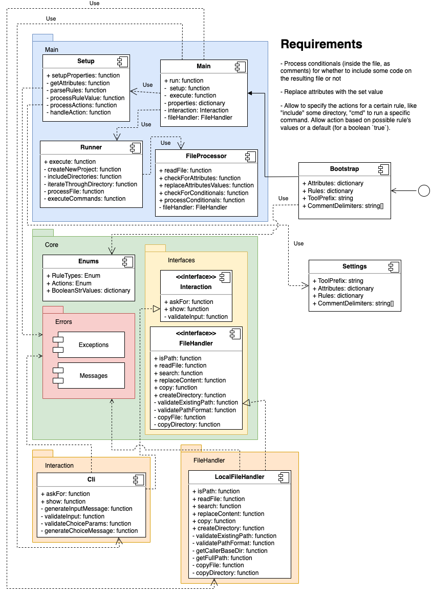

# Cakeslicer

The idea behind this project is to serve as a substitute for Cookiecutter for starting new projects from a starter monorepo, replacing default values and variables and removing code blocks that aren't needed based on the inputs from the user.

The documentation will be improved soon.

> **Note:** Currently, the only developed part is the setup (read and parse rules and attributes and prompt the user for their values). The next steps are the runner and file processor.

## Project structure



## Requirements

- Python 3.10

## Getting started

To get started, you should download this repo's code and put it inside the starters directory, where you have the default sample projects.

Once this is done, you must copy the `cakeslicer.example.py` from this project's directory to the root of the starters project (the directory that contain them all), calling it, for example, [`cakeslicer.py`](./docs/bootstrap-file.md).

After that, you need to [set up your rules](./docs/setting-up-rules.md), like values you're going to check on [some conditionals (TODO)](#) within the starters codes or attributes you need to replace inside them.

## Running

Once all rules and attributes are set, you need to ensure that your `cakeslicer.py` file has a call to the `cakeslicer.run()` method, passing to it all your custom properties set previously in this file.

After that, you just need to open a terminal and run the following command to start up the project's execution:

```sh
> python cakeslicer.py
```

> Note: It may be necessary to give execution permission for this file. If that's the case, just run `chmod +x cakeslicer.py` before running it.
